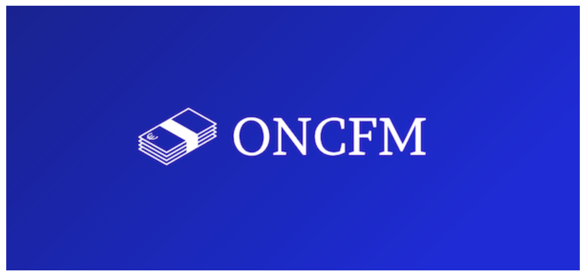

# Counterfeit Application with Machine Learning

I made this application for a project during my formation Data Analyst [OpenClassrooms](https://openclassrooms.com/fr/paths/324-data-analyst#path-tabs)  and I used the dataset that given by the formation center.
The dataset that you see in data folder is the dataset that i cleaned and prepared for application.
You can test application in this [link](https://githubzey-counterfeit-application-with-machine-lear-main-mejdlr.streamlit.app/) and you can use the "billets_production.csv" file for test the application.
Have fun !

                                                                         **The Scenario**

    

    

    
* Je suis consultant Data Analyst dans une entreprise spécialisée dans la data. Mon entreprise a décroché une prestation en régie au sein de l’Organisation nationale de lutte contre le faux-monnayage (ONCFM).

* Cette institution a pour objectif de mettre en place des méthodes d’identification des contrefaçons des billets en euros. Ils me demandent de mettre en place une modélisation qui serait capable d’identifier automatiquement les vrais et faux billets à partir de certaines dimensions du billet.
* Une fois la mission terminée et pendant la présentation des résultats, la responsable du projet d’analyse de données à l’ONCFM, Marie, souhaite voir quels sont les traitements et analyses que j'ai réalisé en amont, les différentes pistes explorées pour la construction de l’algorithme, ainsi que le modèle final retenu.
* Pour la partie analyse, je suis demandé de
    
    * Réaliser une régression logistique
    * Opérer des classifications automatiques pour partitionner les données
    * Réaliser une analyse prédictive
    * Réaliser une régression linéaire

